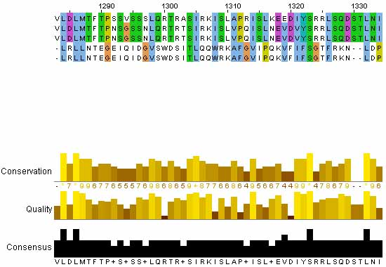
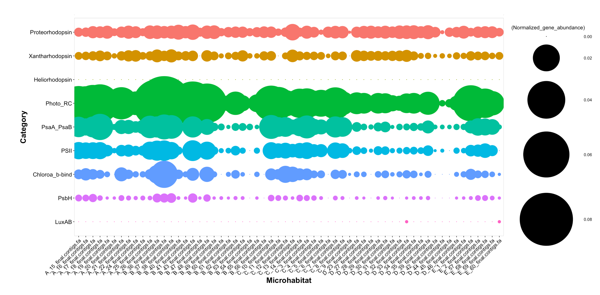
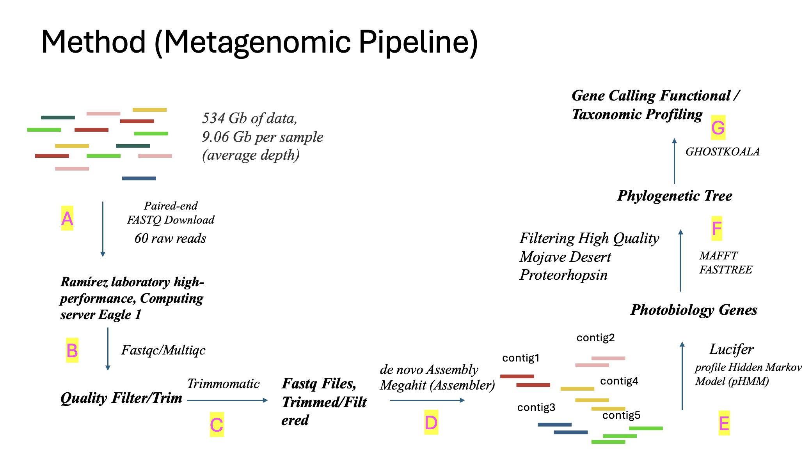

# metagenomic-pipeline
This pipeline is inspired by my master's thesis at Cal State LA. Given the unique ecological and geological aspects of my samples, which are from the Mojave Desert, I intend to focus on identifying light-related genes in these samples. I will filter low-quality reads, perform assembly, identify open reading frames associated with light-related genes, count the predicted proteins, and construct a phylogenetic tree.


#### Definition of Metagenomic 
This is shotgun metagenomic. We only look at a small fraction of the samples and DNA. 
Metagenomic answers questions about what is there and what they are doing there. 
<p align="center">
  
</p>

Image Source:https://astrobiomike.github.io/misc/amplicon_and_metagen

## Download the datasets
In this project 60 raw sequences were dowloaded from NCBI using SRA accesssion number through `prefetch`  `fastqdump`. 
**Make sure you install SRA toolkit**


   
    $ fastq-dump --gzip --skip-technical --readids --read-filter pass --dumpbase --split-3 --clip --outdir path/to/reads/ SRR_ID

this command is to download and process SRA data, ensuring it is properly filtered, compressed, and saved in the desired location, ready for downstream analysis.

---
__Important links in this section :)__

- __[fastqdump](https://rnnh.github.io/bioinfo-notebook/docs/fastq-dump.html)__ - Fastq-dump documention
- __[SRA-Toolkit](https://github.com/ncbi/sra-tools)__ - The NCBI SRA (Sequence Read Archive)

---

This pipeline is not finished yet, the analysis will continue and this pipeline is being updated currently. 


With **one** sample SRR# 
```
prefetch SRR#
```
then fastq-dump, the SRR accession numbers should found under project name at NCBI under samples 
```
fasterq-dump SRR#
```

For loop for more than one metagenome, you can process it faster by writing a for loop in bash download all the samples in this case 60 samples. 
It is always a good practice to write all the ID names in separate files (.txt) for a variety of commands. Here we can use it for parallel download. 

```
for i in$(cat <SRR list>.txt) do ;  prefetch $i ; fastq-dump --splitfiles $i
```
Here my list.txt file is the file containing all of my sample id manes and is used to  process a list of Sequence Read Archive (SRA) accession numbers (e.g., SRR1234567, SRR1234568) from a file named <SRR list>.txt. 

1. Reads the file **<SRR list>**.txt line by line.
2. Download the **SRA** file corresponding to each accession number using Prefetch.
3. Converts the SRA file into **FASTQ format** with fastq-dump, **splitting** paired-end reads into separate files if applicable.
4. Repeats this process for every accession number in the list.

## Quality trimming/filtering

Typically, sequencing facilities provide sequencing data in FASTQ files. The FASTQ format consists of four lines per sequence: (1) the sequence identifier (header) prefixed with an "@" symbol, (2) the sequence itself, (3) a "+" symbol (sometimes followed by a repeat of the header), and (4) quality scores for each base. With Illumina sequencing, these quality scores indicate the software's confidence in each base call. Although this system isn't flawless—factors like polymerase errors and systematic biases can impact accuracy without being reflected in the quality scores—performing quality-based filtering remains crucial.

A highly user-friendly tool, **FastQC**, provides a comprehensive overview of data quality. It can identify common issues and guide your quality-filtering decisions effectively.

most often for quality filtering due to its flexibility would be **Trimmomatic**.

---
__Important links in this section :)__

- __[FastQ](https://www.bioinformatics.babraham.ac.uk/projects/fastqc/)__ - Quality Control before trimming and filtering since each data is different 
- __[Trimmomatic](http://www.usadellab.org/cms/?page=trimmomatic)__ - read trimming tool for Illumina NGS

---
Trimming using trimmomatic and the parametrets that were used is shown below:
```
# Run Trimmomatic in parallel for multiple paired-end FASTQ files
# Adjust NUM_SAMPLES, THREADS, and paths as needed

NUM_SAMPLES=60
THREADS=8
TRIMMOMATIC_JAR=/path/to/Trimmomatic-0.39/trimmomatic-0.39.jar
ADAPTERS=/path/to/Trimmomatic-0.39/adapters/TruSeq3-PE.fa

seq $NUM_SAMPLES | parallel "
  java -jar ${TRIMMOMATIC_JAR} PE -threads ${THREADS} -phred33 \
  {}_1.fastq {}_2.fastq \
  {}_R1P.fastq {}_R1UP.fastq {}_R2P.fastq {}_R2UP.fastq \
  ILLUMINACLIP:${ADAPTERS}:2:30:10 \
  LEADING:3 TRAILING:3 SLIDINGWINDOW:4:15 MINLEN:36
"

```
How it trimmomatic is trimming: 
| Step             | Parameter            | What it does                       | Threshold                 |
| ---------------- | -------------------- | ---------------------------------- | ------------------------- |
| Adapter trimming | `ILLUMINACLIP`       | Removes adapter contamination      | Mismatch ≤2, score ≥30/10 |
| 5′ trim          | `LEADING:3`          | Removes low-quality bases at start | Q < 3                     |
| 3′ trim          | `TRAILING:3`         | Removes low-quality bases at end   | Q < 3                     |
| Quality trimming | `SLIDINGWINDOW:4:15` | Cuts when average Q < 15 over 4 bp | Q < 15                    |
| Length filter    | `MINLEN:36`          | Drops reads shorter than 36 bp     | 36 bp                     |

## Assembly
Assembly is basically like a puzzle that has so many pieces and you have to build it up and guess which piece belong to where. There are varieties of assemblers are out there and each has its own pros and cons. Here I will introduce two assemblers which are more popular for microbial genomics including metagenomics. 

One of them is MEGAHIT which is a de novo assembler meaning without templates. It is designed for large and complex metagenomic datasets, using a succinct de Bruijn graph (SdBG) approach for memory efficiency and speed. It begins by preprocessing reads to remove low-quality sequences and adapters, followed by extracting k-mers (substrings of length \( k \)) across multiple \( k \)-mer sizes (multi-\( k \) strategy) to improve assembly accuracy. The SdBG efficiently represents overlaps between k-mers, reducing memory usage. MEGAHIT simplifies the graph by removing tips (dead-ends), bubbles (parallel paths), and collapsing repeats, ensuring a cleaner assembly. Iterative assembly refines the graph using smaller \( k \)-mers for sensitivity to low-abundance reads and larger \( k \)-mers for resolving repetitive regions. Contigs are then constructed from the simplified graph and output in FASTA format. Its multi-threading capability enhances speed, and the use of multi-\( k \) improves assembly quality for datasets with varying coverage, making MEGAHIT ideal for metagenomic studies on standard computational resources.

megahit installation 
```
conda install -c bioconda megahit
```

```
# Generate a sequence of numbers from 1 to 60 and run MEGAHIT in parallel for each sample
seq 60 | parallel \
  megahit \
    -1 /data/Biocrust/2024_Clean/Raw_Reads/ordered_fastq_raws/Trimmed/{}_R1P.fastq \  # Forward reads (R1)
    -2 /data/Biocrust/2024_Clean/Raw_Reads/ordered_fastq_raws/Trimmed/{}_R2P.fastq \  # Reverse reads (R2)
    -o {}_Megahit_out  # Output directory for each sample
```

1. seq 60: Generates numbers 1 through 60, representing sample identifiers.
2. parallel: Runs MEGAHIT commands concurrently for multiple samples.
3. -1 and -2: Paths to forward (R1P.fastq) and reverse (R2P.fastq) read files.
The {} placeholder is replaced with numbers from seq 60 (e.g., 1_R1P.fastq, 2_R1P.fastq).
4. -o: Specifies output directories named {sample_number}_Megahit_out for each dataset.

This command needs to be run on screen since it can take couple days its a huge dataset: 1.5 TB


---
__Important links in this section :)__

- __[Megahit](https://academic.oup.com/bioinformatics/article/31/10/1674/177884__) - Quality Control before trimming and filtering since each data is different 
- __[Megahit GitHub](https://github.com/voutcn/megahit)__ - read trimming tool for Illumina NGS

---
When working on large datasets and running an analysis, usually could take hours or even days. So knowing running analysis on **screen** is an important knowledge and tool to use. Where you're running a lengthy task on a remote machine, and then your connection drops, causing the SSH session to terminate and your progress to be lost. There is a utility called `screen` that allows us to resume the sessions.

Screen, also known as GNU Screen, is a terminal multiplexer. This means you can start a screen session and open multiple windows (virtual terminals) within it. The processes running in Screen will keep running even if their window is not visible, and will continue to do so even if you get disconnected.

The screen package is pre-installed on most Linux distros nowadays. You can check if it is installed on your system by typing: 

  
    screen --version


to see the lists of the attached screen
  

    screen -ls

After assembling the data, I will search for open reading frames of genes that encode light-related pathways. This exploration stems from my curiosity about how bacteria survive in such extreme environments. I aim to uncover the mechanisms of energy production, primarily focusing on **photosynthesis** as the main pathway, along with alternative, less energetically demanding mechanisms. Notably, **photosynthesis** is highly energy-intensive for microbial species, making these alternative pathways particularly intriguing.

****Assembly Statistics:**** 
| **Assembly Metric**              | **Value** | **Description**                                                              |
| -------------------------------- | --------- | ---------------------------------------------------------------------------- |
| **Number of contigs (≥1000 bp)** | 66,176    | Total count of contigs longer than 1,000 base pairs                          |
| **Largest contig (bp)**          | 406,396   | Length of the longest assembled contig                                       |
| **N50 (bp)**                     | 854       | Median contig length weighted by total assembly size (measure of contiguity) |
| **GC content (%)**               | 64.3      | Proportion of guanine and cytosine bases in the genome                       |
| **Predicted ORFs (N ORFs)**      | 641,490   | Number of open reading frames predicted in the assembly                      |

**N50: 854 bp**

This is low, but for a highly diverse metagenome like the Mojave Desert microbial communities, it's often the best you can achieve with short reads alone. Metagenomes contain communities with vastly different abundances. Low-abundance species will yield very shallow coverage, making it impossible to assemble their genomes into long contigs.

**Largest contig: 406,396 bp**

The existence of a contig this long is positive. It suggests that at least one or a few high-abundance organisms in your sample had high enough coverage to assemble well, potentially yielding partial (or even near-complete) draft genomes later.


### HMM Search
***Hidden Markov Model*** (HMM) is position sensitive models and it is a probabibilistic approach where it incorporate random variables and probability distributions into the model of an event of phenomenon. 
It requires building a profile based on a training datasets. It is like machine learning approaches.  It is very sensitive. 

HMM starts with a multiple sequence alignment. It targets region that are conserved versus what is less conserved. This is where the accuracy and sensitivity come in. 


<div style="text-align: center;">
    
</div>
source: http://compbio.pbworks.com/w/page/16252909/Multiple%20Sequence%20Alignment


The sotware that has been used here to look for photon related genes in my assemblies file is **MagicLamp** https://github.com/Arkadiy-Garber/MagicLamp which is a sotware for annotations genomic or metagenomic datasets and it is HMM sets. There are different genies in these software that comes with the package when installing it on your system. However, there is options where your unique questions and genies cant be found here and you can actully upload your costume HMM which is an easy process. More information and installation can be found in the github page. 

if you typpe Lucifer.py -h you can see all the different flags for this specific command. 


This is how you set up after installing magiclamp. 
if you typpe Lucifer.py -h you can see all the different flags for this specific command. 

```
conda activate magiclamp
MagicLamp.py Lucifer -bin_dir /directorty-of-your-stored-genomes-or-contigs -bin_ext fna -out Lucifer_out --norm
```

After running magiclamp, you will get two different files, both are in CSV file. One is a heat map (basically counting the hits for each genes) and the othe is providing the predicted protein sequence with the score value, and the name of the predicted protein and ID number. 

The heatmap hits will be used to run it on an R script for dot plots and the other csv summary file will be used for downatream analysis such as alignment and phylogentic tree constructions.


### Why HMM Search/Probabilistic Approach to Homology

#### Pairwise Sequence Alignment/Multiple Sequence Alignment
In this approach, the aligner compares sequeces directlty based on nucleotides or amino acid similarities usign subsitution matrices ( BLOSUM, PAM). It works well for closely related sequences but struggle with the distant homology detection. It penlized with fixed gap penalities. <br>

#### Profile Hidden Markov Model (HMM) Alignment
However, in pHMM, it uses statistical model (profile HMM) trained on multiple sequence alignment to capture position-specific conservation patterns (insertions, deletions, highly conserved positions). It is excelent for distant homologs. <br>

##### When to Use Profile HMMs?<br>
When aligning sequences with high variability but conserved functional motifs.
When searching for remote homologs in metagenomic or evolutionary studies.
When building custom protein/domain families (e.g., Pfam).


---
__Important links in this section :)__

- __[MagicLamp](https://github.com/Arkadiy-Garber/MagicLamp)__ - A software package for annotation of genomic datasets using discreet HMM sets. 

---

After running magiclamp, the output files contain 2 CSV files which are important part of the analysis of the predicted protein. The heatmap.csv file is a dot plot illustrating the abundance of each gene within the genome or metagenome and this is important and required if visulizastion is needed, various R packages should be installed and available for use with the Rscript command-line tool.


---
__Important links in this section :)__

- __[MagicLamp-RScripts](https://github.com/Arkadiy-Garber/MagicLamp/tree/master/rscripts)__ - Dot Plots R scripts

---
Here, I will past the R-Dot plot of the result of the magiclamp software that we ran on our contigs, and here, since we specifically look at the genes that are photon-related (Lucifer genie) or light-related, we can see which genes are involved as a response to light. 
___ 

<figure>
  
  <figcaption>A survey of photo-related genes. Profile Hidden Markov Model survey of genes related to photobiology.</figcaption>
</figure>

___

Here as you can see in the figure about we see all the genes associated with light such as **Photosynthesis** which is shows as **PsaA_PsaB**, ***Photo_RC** (photo reaction center which is responsible for the initial electron transfer reactions triggered by light absorption), **PSII** is responsible for the initial step of oxygenic photosynthesis, splitting water molecules to generate electrons, protons, and oxygen gas. All of these genes have big dot plots, which suggests many activities being carried out by these microbes across various habitats (hypolith versus biocrust). In this context, hypolith environment refers to communities under rocks, especially quartz rocks, and biocrust refers to microbial communities exposed to the sun directly on the surface layers of Mojave. 
___


This dot plot is the first step in answering this hypothesis: whether the biocrust microbial community in the Mojave desert carries any proteorhopsin genes. Based on the 
We can safely say that the dot for proteorhopsin genes, which are in the Y-axis, are prevalent among different microhabitats. 
<figure>
  
  <figcaption> Metagenome Pipeline Workflow.</figcaption>
</figure>

This pipeline is not finished yet; the analysis will continue, and this pipeline is currently being updated. 
